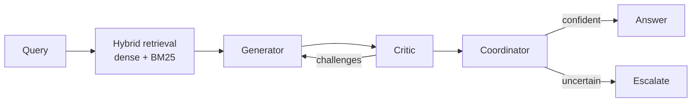
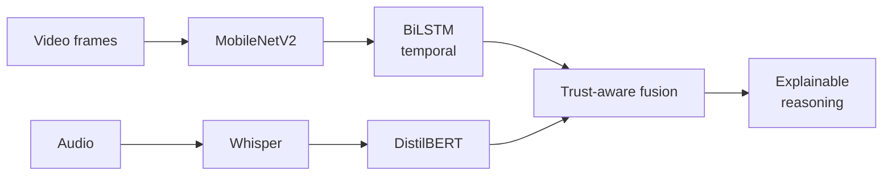

<!--
  SETUP — replace these placeholders before publishing:
    YOUR_LINKEDIN_URL      → full LinkedIn profile URL
    YOUR_HF_USERNAME       → your Hugging Face handle
    REPO_* / DEMO_* / VIDEO_* links → the links already on your resume
-->

<picture>
  <source media="(prefers-color-scheme: dark)" srcset="./assets/header-dark.svg">
  
</picture>

<p align="center">
  <a href="https://git.io/typing-svg"></a>
</p>

<p align="center">
  <a href="mailto:raghavpimoli5@gmail.com"></a>
  <a href="YOUR_LINKEDIN_URL"></a>
  <a href="https://huggingface.co/YOUR_HF_USERNAME"></a>
  
</p>


<picture>
  <source media="(prefers-color-scheme: dark)" srcset="./assets/sec-about-dark.svg">
  
</picture>

I'm an AI/ML engineer who builds end-to-end systems — from fine-tuning and agent design to deployment — and **holds them to an evaluation harness before trusting them**. Every number below comes with a baseline, a held-out set, and the trade-offs reported, not hidden.

```yaml
name:      Raghav Pimoli
role:      AI / ML Engineer
education: M.Sc. Artificial Intelligence & Machine Learning — IIIT Lucknow (2024–26)
focus:     [LLM fine-tuning, LLM evaluation, agentic AI, multimodal AI, computer vision, MLOps]
habits:    baselines first · deterministic evals · report the trade-off
based_in:  Dehradun, India
open_to:   full-time AI / ML Engineer roles
```

<picture>
  <source media="(prefers-color-scheme: dark)" srcset="./assets/impact-dark.svg">
  
</picture>


<picture>
  <source media="(prefers-color-scheme: dark)" srcset="./assets/sec-projects-dark.svg">
  
</picture>

### `01` &nbsp;Legal Contract LLM — QLoRA fine-tuning with before/after evaluation

<p>
  
  
  
</p>

Fine-tuned **Qwen2.5-7B** with QLoRA (4-bit, 0.5% of weights trained) on **CUAD** — 510 expert-annotated contracts — for clause classification and grounded clause Q&A. Trained on a free Kaggle T4, served on a 6 GB laptop GPU.

**[Repository](REPO_LEGAL_LLM) · [Model on 🤗](HF_MODEL_LINK) · [Video](VIDEO_LEGAL_LLM)**

<details>
<summary><b>▸ How it was evaluated</b></summary>
<br>

- Deterministic harness — **no LLM judge** — over 400 held-out items
- Three-way comparison: zero-shot vs. 3-shot prompting vs. fine-tuned
- Hallucinations audited by hand

| Metric | Zero-shot | 3-shot | **Fine-tuned** |
|---|---:|---:|---:|
| Classification accuracy | 61.5% | 63.5% | **80.0%** |
| Missed clauses | 57% | — | **5%** |
| Calibration error | 0.28 | — | **0.03** |
| Hallucination rate | 1.0% | — | 3.5% ⚠️ |

> The trade-off is reported, not hidden: fine-tuning raised hallucinations from 1.0% to 3.5%.

**Stack:** PyTorch · Hugging Face Transformers / PEFT / TRL · FastAPI · Streamlit
</details>

---

### `02` &nbsp;Adversarial Verification System with LLM Evaluation Harness

<p>
  
  
  
</p>

A multi-agent pipeline — **Generator → Critic → Coordinator** in LangGraph — that adversarially checks LLM outputs against retrieved evidence before returning them, with hybrid dense + BM25 retrieval and calibrated confidence scoring.

**[Repository](REPO_ADVERSARIAL) · [Video](VIDEO_ADVERSARIAL)**

<details>
<summary><b>▸ How it was evaluated</b></summary>
<br>

- Custom 50-prompt harness, two independent batches × 3 runs = **300 evaluations**
- Tracked hallucination rate, calibration, and false-escalation rate
- False-escalation rate held at **2.7% across every run**



**Stack:** LangGraph · OpenAI API · ChromaDB · FastAPI · Streamlit · Docker · MLflow
</details>

---

### `03` &nbsp;Multimodal Agentic AI Platform for Behavioral Intelligence &nbsp;<sub>M.Sc. thesis</sub>

<p>
  
  
  
</p>

A platform that fuses **vision, speech and language** to analyse behavioural consistency — trust-aware multimodal fusion, temporal behavioural modelling, and explainable reasoning, deployed end-to-end on FastAPI.

**[Repository](REPO_MULTIMODAL) · [Live demo](DEMO_MULTIMODAL)**

<details>
<summary><b>▸ Architecture</b></summary>
<br>



**Stack:** PyTorch · MobileNetV2 · DistilBERT · BiLSTM · Whisper · OpenCV · FastAPI · Docker
</details>

---

### `04` &nbsp;Sensitive-Area Intrusion Detection System

<p>
  
  
  
</p>

Full-stack real-time surveillance: a fine-tuned **YOLOv8** detector with **DeepSORT** tracking and a rule engine for zone-intrusion, weapon, and dropped-object alerts, streamed live to the browser over WebSockets.

**[Repository](REPO_INTRUSION) · [Try it](DEMO_INTRUSION) · [Video](VIDEO_INTRUSION)**

<details>
<summary><b>▸ How it works</b></summary>
<br>

- Incident-based alerting model, so one event raises one alert rather than one per frame
- Live webcam detection over a WebSocket pipeline to a React front end
- Data and model versioning with DVC

**Stack:** PyTorch · YOLOv8 · DeepSORT · FastAPI · React · Docker · DVC
</details>


<picture>
  <source media="(prefers-color-scheme: dark)" srcset="./assets/sec-toolkit-dark.svg">
  
</picture>

<p align="center">
  
</p>

<p align="center">
  
  
  
  
  
  
  
  
</p>

<details>
<summary><b>▸ Full skill map</b></summary>
<br>

| Area | Skills |
|---|---|
| **LLM & agentic AI** | QLoRA / LoRA fine-tuning, LLM evaluation, RAG, prompt engineering, multi-agent systems |
| **Machine learning** | Deep learning, computer vision, NLP, speech AI, multimodal AI, reinforcement learning |
| **MLOps** | Docker, MLflow, DVC, FastAPI, Linux, Git |
| **Languages & data** | Python, SQL, PostgreSQL, MySQL, C, C++ |
</details>

<details>
<summary><b>▸ GitHub activity</b></summary>
<br>
<p align="center">
  
  
</p>
</details>


<picture>
  <source media="(prefers-color-scheme: dark)" srcset="./assets/sec-contact-dark.svg">
  
</picture>

<p align="center">
  <b>Building something that needs to be measured, not guessed? Let's talk.</b><br><br>
  <a href="mailto:raghavpimoli5@gmail.com"></a>
  <a href="YOUR_LINKEDIN_URL"></a>
</p>


