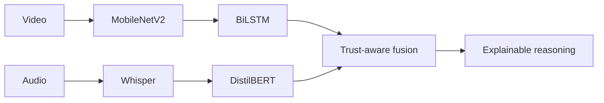

<picture>
  <source media="(prefers-color-scheme: light)" srcset="./assets/header-light.svg">
  
</picture>

 

I build AI systems end to end (fine-tuning, agents, computer vision and deployment) and evaluate each one against a baseline on held-out data.

  

<picture>
  <source media="(prefers-color-scheme: light)" srcset="./assets/sec-work-light.svg">
  
</picture>

  <a href="https://github.com/raghavpli515/Legal-contract-LLM-fine-tuning-with-evaluation"><picture><source media="(prefers-color-scheme: light)" srcset="./assets/project-01-light.svg"></picture></a>

  <a href="https://github.com/raghavpli515/adversarial-verification"><picture><source media="(prefers-color-scheme: light)" srcset="./assets/project-02-light.svg"></picture></a>

  <a href="https://github.com/raghavpli515/Agentic-multimodal-behavioral-consistency-analysis"><picture><source media="(prefers-color-scheme: light)" srcset="./assets/project-03-light.svg"></picture></a>

  <a href="https://github.com/raghavpli515/Sensitive-area-Intrusion-detection-system"><picture><source media="(prefers-color-scheme: light)" srcset="./assets/project-04-light.svg"></picture></a>

<picture>
  <source media="(prefers-color-scheme: light)" srcset="./assets/capabilities-light.svg">
  
</picture>

  

<picture>
  <source media="(prefers-color-scheme: light)" srcset="./assets/sec-notes-light.svg">
  
</picture>

<b>01 &nbsp;Legal Contract LLM</b> &nbsp;·&nbsp; QLoRA fine-tuning with before/after evaluation

 

Fine-tuned **Qwen2.5-7B** with QLoRA (4-bit, 0.5% of weights trained) on **CUAD** — 510 expert-annotated contracts — for clause classification and grounded clause Q&A. Trained on a free Kaggle T4; served on a 6 GB laptop GPU.

| Held-out set (400 items) | Zero-shot | 3-shot | **Fine-tuned** |
|---|---:|---:|---:|
| Classification accuracy | 61.5% | 63.5% | **80.0%** |
| Missed clauses | 57% | — | **5%** |
| Calibration error | 0.28 | — | **0.03** |
| Hallucination rate | 1.0% | — | 3.5% |

Deterministic harness, no LLM judge, hallucinations audited by hand. The hallucination increase is the trade-off, reported rather than hidden.

`PyTorch` `Transformers` `PEFT` `TRL` `FastAPI` `Streamlit` &nbsp;→&nbsp; [Repository](https://github.com/raghavpli515/Legal-contract-LLM-fine-tuning-with-evaluation) · [Model](https://huggingface.co/PimoLee5/qwen2.5-7b-cuad-qlora) · [Video](https://youtu.be/hcN9TmknxCs)

<b>02 &nbsp;Adversarial Verification System</b> &nbsp;·&nbsp; multi-agent checking with an evaluation harness

 

A **Generator → Critic → Coordinator** pipeline in LangGraph that checks LLM outputs against retrieved evidence (hybrid dense + BM25) before returning them, with calibrated confidence scoring.

| 300 evaluations (50 prompts × 2 batches × 3 runs) | Baseline | **Verified** |
|---|---:|---:|
| Hallucination rate | 4.0% | **0.7%** |
| Accuracy | 76.7% | **86.7%** |
| False-escalation rate | — | **2.7%**, every run |

`LangGraph` `OpenAI API` `ChromaDB` `FastAPI` `Docker` `MLflow` &nbsp;→&nbsp; [Repository](https://github.com/raghavpli515/adversarial-verification) · [Video](https://youtu.be/bDHBv1_jPOI)

<b>03 &nbsp;Multimodal Behavioral Intelligence</b> &nbsp;·&nbsp; M.Sc. thesis

 

Fuses **vision, speech and language** to analyse behavioural consistency: trust-aware multimodal fusion, temporal modelling and explainable reasoning, deployed end to end on FastAPI.

**70.83%** accuracy · **81.34%** precision · **70.41%** F1

`PyTorch` `MobileNetV2` `DistilBERT` `BiLSTM` `Whisper` `OpenCV` `Docker` &nbsp;→&nbsp; [Repository](https://github.com/raghavpli515/Agentic-multimodal-behavioral-consistency-analysis) · [Demo video](https://youtu.be/6ccAVwpaJxg)

<b>04 &nbsp;Sensitive-Area Intrusion Detection</b> &nbsp;·&nbsp; real-time computer vision

 

A fine-tuned **YOLOv8** detector with **DeepSORT** tracking and a rule engine for zone-intrusion, weapon and dropped-object alerts. Incident-based alerting (one event, one alert) streamed live to a React front end over WebSockets.

**87.8%** precision · **79.7%** recall · **86.0%** mAP50

`PyTorch` `YOLOv8` `DeepSORT` `FastAPI` `React` `Docker` `DVC` &nbsp;→&nbsp; [Repository](https://github.com/raghavpli515/Sensitive-area-Intrusion-detection-system) · [Try it](https://huggingface.co/spaces/PimoLee5/intrusion-detection-system) · [Video](https://youtu.be/AlxbYcq7480)

<b>Toolkit</b>

 

Also: Hugging Face (Transformers, PEFT, TRL) · LangGraph · OpenAI API · ChromaDB · MLflow · DVC · YOLO · Whisper · C / C++

 

<picture>
  <source media="(prefers-color-scheme: light)" srcset="./assets/footer-light.svg">
  
</picture>
